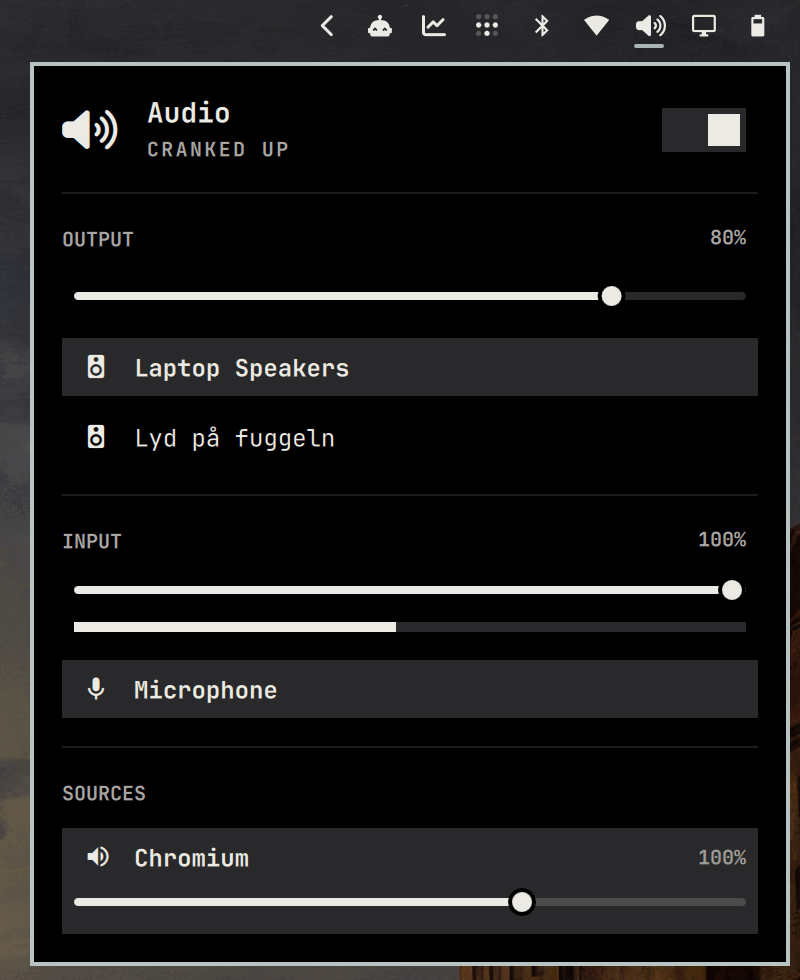

# Wi-Fi Speakers for Omarchy Quattro

A native Quickshell overlay for live-discovered Google Cast and AirPlay audio
receivers. It keeps discovery out of the UI process, uses one atomic cache, and
routes applications through Omarchy's current PipeWire output helper.

Unlike the original local backend, this version does not require EasyEffects or
assume a sink named `easyeffects_sink`. It works with Quattro's
`omarchy_speaker_tuning`, headphones, HDMI, or an unprocessed default sink and
restores whichever output was active before the Wi-Fi route.



When a network receiver is available as a PipeWire output, it appears alongside
local devices in Omarchy's built-in Audio panel.

## Install

Install runtime dependencies and the plugin:

```bash
omarchy pkg add avahi ffmpeg iproute2 jq pipewire-pulse python-pychromecast
omarchy plugin add https://github.com/stappmus/omarchy-wifi-speakers.git --enable
~/.config/omarchy/plugins/stappmus.wifi-speakers/setup.sh
```

The final command links and enables the included user discovery service. It
refuses to replace an unrelated service file.

If UFW is active, allow only private-network receivers to reach the streaming
ports used by Cast and AirPlay:

```bash
sudo ufw allow proto tcp from 10.0.0.0/8 to any port 49785 comment allow-stappmus-cast-audio
sudo ufw allow proto tcp from 172.16.0.0/12 to any port 49785 comment allow-stappmus-cast-audio
sudo ufw allow proto tcp from 192.168.0.0/16 to any port 49785 comment allow-stappmus-cast-audio
sudo ufw allow proto udp from 10.0.0.0/8 to any port 6001:6129 comment allow-stappmus-airplay-audio
sudo ufw allow proto udp from 172.16.0.0/12 to any port 6001:6129 comment allow-stappmus-airplay-audio
sudo ufw allow proto udp from 192.168.0.0/16 to any port 6001:6129 comment allow-stappmus-airplay-audio
```

Open the plugin's standalone selector with:

```bash
~/.config/omarchy/plugins/stappmus.wifi-speakers/scripts/open-overlay
```

The optional [`extras/wifi-speakers.lua`](extras/wifi-speakers.lua) shows the
Quattro bindings used for the selector and route-aware volume keys. Copy it to
`~/.config/hypr/`, then add this to `~/.config/hypr/bindings.lua`:

```lua
require("hypr.wifi-speakers")
```

The two shell wrappers in `extras/` are compatibility shims for older local
bindings that referenced `~/.local/bin`; new installations do not need them.

## How routing works

- Discovery keeps two targeted Avahi browsers alive and reconciles a coherent
  snapshot periodically. Identical status and speaker generations are not
  rewritten.
- The overlay itself is loaded only while open; closing it releases its QML
  model and file watchers while discovery continues in the small user service.
- Cast creates a temporary null sink, moves only real application streams to
  it, and serves its monitor on TCP port 49785. Receiver volume is controlled
  over a local Unix socket.
- AirPlay creates a transient PipeWire RAOP sink and selects it with Omarchy's
  standard output helper.
- Disconnecting stops the transient user service, removes the temporary sink,
  and restores the exact previous default output.

Only the selected Cast receiver's IP may fetch its generated stream URL. Route
state and control sockets live under the user's runtime directory.

## CLI

```bash
plugin=~/.config/omarchy/plugins/stappmus.wifi-speakers
$plugin/scripts/audio-output list --json
$plugin/scripts/audio-output current --json
$plugin/scripts/audio-output connect SPEAKER_ID cast
$plugin/scripts/audio-output internal
$plugin/scripts/audio-output volume raise
```

## Remove

Disable the discovery service before removing the plugin:

```bash
systemctl --user disable --now omarchy-audio-speaker-discovery.service
unit=~/.config/systemd/user/omarchy-audio-speaker-discovery.service
[[ -L $unit ]] && unlink "$unit"
systemctl --user daemon-reload
omarchy plugin remove stappmus.wifi-speakers
```

## Test

```bash
./test/run.sh
qmllint -I /usr/share/omarchy/shell WifiSpeakers.qml
omarchy plugin validate .
```

The mock route tests do not change the host's real PipeWire graph. A physical
Cast or AirPlay receiver is still required for a complete end-to-end test.

Licensed under the MIT License.
